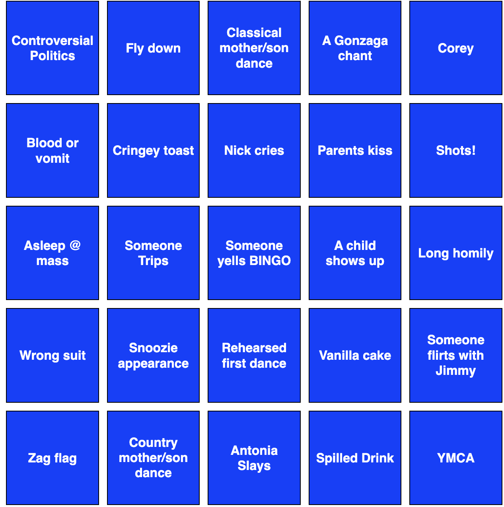

# WeddingBingo 🎉

Some projects are technically complex. This one was just the right tool at the right time.

I was sitting with a group of college friends I hadn't seen in years, catching up before our friend's wedding. Someone suggested wedding bingo — and then dared me to build a website so everyone could play on their phones during the reception. I'd been learning Azure recently, so I took the dare. A few hours later, we had a live web app. People used it at the wedding. It was a hit.

**Live app:** [WeddingBingo.azurewebsites.net](https://WeddingBingo.azurewebsites.net) *(Azure deployment paused to avoid costs — see [Running Locally](#running-locally))*



---

## What It Does

Each page load generates a unique, shuffled bingo card filled with wedding-specific predictions — things like *"Nick cries"*, *"Zag flag"*, *"Someone flirts with Jimmy"*, and *"Antonia Slays"*. Guests tap squares to mark them off as the night unfolds. No printing, no app download, no setup — just send the link.

- Every page load generates a fresh, uniquely shuffled card
- Fixed free space in the center: *"Someone yells BINGO"*
- Tap or click any square to mark it — no page reload needed
- Dynamic font scaling so all text fits cleanly regardless of length
- Mobile-friendly layout built for guests on their phones

---

## How It Works

A single Flask route shuffles the 24 custom squares, injects the free space at center position (2,2) of the 5×5 grid, and renders the board via Jinja2.

```python
for i in range(5):
    for j in range(5):
        if i == 2 and j == 2:
            row.append("Someone yells BINGO")
        else:
            row.append(bingo_texts[count])
```

The frontend is intentionally light — a click toggles a `marked` CSS class, and a small JS function dynamically shrinks font size until text fits its cell cleanly.

```
app.py              # Flask app — shuffles squares and serves the board
templates/
  bingo.html        # Jinja2 template — renders the 5×5 grid
static/
  styles.css        # Board layout, square styling, marked state
  scripts.js        # Click-to-mark toggle + dynamic font sizing
requirements.txt    # Python dependencies
```

---

## Deployment

The app was deployed to **Azure App Service** (Free Tier) the same day it was built, using Azure CLI and Git-based deployment. It served real users at a real wedding — which, honestly, is the metric that matters most for this one.

The deployment is now paused to avoid charges, but the full sequence of commands to recreate it is documented in [`Summary of Deploy Commands.txt`](Summary%20of%20Deploy%20Commands.txt).

The core steps:
1. Create a resource group and Linux App Service Plan (Free Tier)
2. Configure Git remote deployment via `az webapp deployment`
3. Push with `git push azure main`

---

## Running Locally

**Requirements:** Python 3.x

```bash
git clone https://github.com/James-Winslow/WeddingBingo.git
cd WeddingBingo
pip install -r requirements.txt
python app.py
```

Open [http://localhost:5000](http://localhost:5000). Refresh for a new card.

---

## Stack

| | |
|---|---|
| Backend | Python, Flask |
| Frontend | HTML, CSS, JavaScript |
| Templating | Jinja2 |
| Hosting | Azure App Service (Free Tier) |
